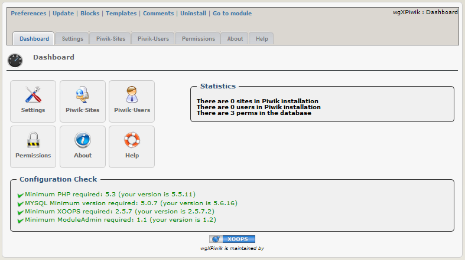

# Introduction

## Module wgXPiwik

#### Version: 1.06 RC1

#### for XOOPS 2.5.7 / XOOPS 2.5.8

### User Manual

© 2014 The XOOPS Project \(www.xoops.org\)

### Module Purpose

This simple module is for implementation of Piwik to your Xoops website.

* Piwik is included in the module
* Installing Piwik can be started from module, but you can't admin Piwik himself \(create user, admin user rights,...\) via this module. You have to use Piwik admin ui.
* You can provide Piwik Charts/Widgets via iframe on user site. As Piwik function 'logme' is used, therefore no separate login for your users is necessary.
* The permissions for Xoops User you can set per group in the module
* Tracking will be done via a block. Therefore you can activate tracking only for specific modules, all modules or only the startpage.

For detailed information about Piwik and widgets of Piwik goto [http://piwik.org](http://piwik.org)

  
 _Figure 1: Main view of the wgxPiwik Module \(Admin side\)_

## Table of Content

* [Install/Uninstall](install-uninstall.md)
* [Administration Menu](administration-menu.md)
* [Preferences](https://github.com/xoops/wgxpiwik-tutorial/tree/44462b3532f18ebc216e51991d4b4a47d55ccd80/en/book/3preferences.md)
* [Operating Instructions](operating-instructions.md)
* [The User Side](the-user-side.md)
* [Blocks](blocks.md)
* [Templates](templates.md)
* [Module Credits](module-credits.md)

### License:

  
Unless specified, this content is licensed under a [Creative Commons Attribution-NonCommercial-ShareAlike 4.0 International License](http://creativecommons.org/licenses/by-nc-sa/4.0/).

All derivative works are to be attributed to XOOPS Project \(www.xoops.org\)

