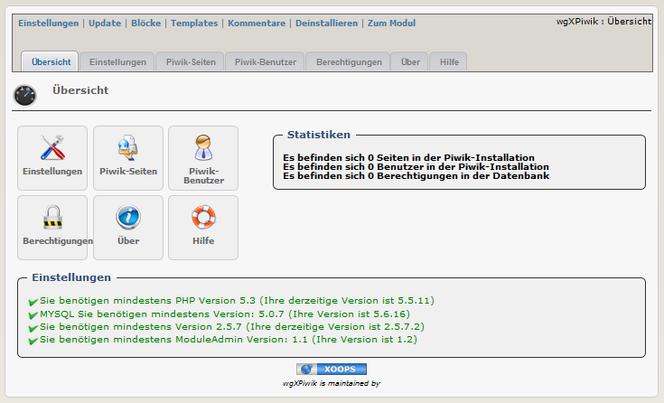

### _XOOPS Documentation Series_

# Module wgXPiwik
#### Version: 1.06 RC1
#### für XOOPS 2.5.7+
#### für PHP 5.5, 5.6 an 7.0
      

            
## Bedienungsanleitung

© 2014 The XOOPS Project (www.xoops.org)    

## Basisinformation zum Modul

wgXPiwik ist ein einfaches Modul, um Piwik über iframe in ihr Xoops einzubinden.

* Piwik ist im Modul enthalten
* Die Installation von Piwik kann vom Modul aus gestartet werden, aber Sie können die Einstellungen von Piwik selbst nicht verwalten (User erstellen, Berechtigungen der user verwalten,...). Dies hat über die Piwikoberfläche zu erfolgen.
* Sie können die Piwik Charts/Widgets via iframe auf der Userseite anzeigen lassen/zur Verfügung stellen. Da die Piwikfunktion 'logme' verwendet wird, ist ein seperater Login nicht erforderlich.
* Die Berechtigungen für die Xoops User können je Gruppe verwaltet werden
* Das Tracking ihrer Seiten erfolgt über einen Block. Sie können daher das Tracking nur für bestimmte Seiten, alle Seiten oder nur die Startseite aktivieren.

Für detailierte Informationen über Piwik und die Widgets in Piwik besuchen sie bitte http://piwik.org/

 
*Figure 1: Hauptübersicht des Moduls wgTeams (Admin-Bereich)*

# Inhaltsverzeichnis

* [(De-)Installation](book/1install.md)
* [Administrationsbereich](book/2administration.md)
* [Einstellungen](book/3preferences.md)
* [Benutzerbereich](book/5userside.md)
* [Blöcke](book/6blocks.md)
* [Templates](book/7templates.md)
* [Modul Credits](book/9credits.md)

## Lizenzbestimmungen:

 Sofern nicht anders angegeben, fällt dieser Inhalt unter die Lizenzbestimmungen <a rel="license" href="http://creativecommons.org/licenses/by-nc-sa/4.0/">Creative Commons Attribution-NonCommercial-ShareAlike 4.0 International License</a>.

Alle Derivate sind Teil von XOOPS Project <a rel="xoops" href="http://www.xoops.org">www.xoops.org</a>

##Bedienungsanleitung Version: 1.1