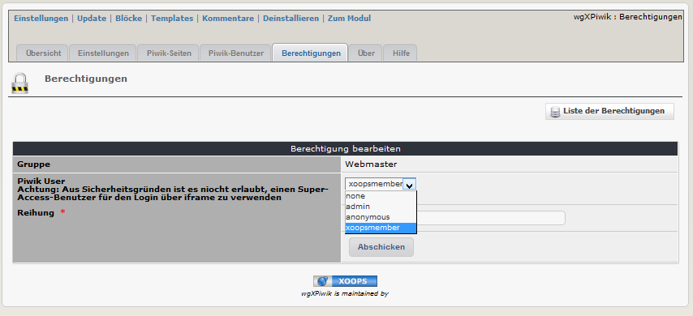
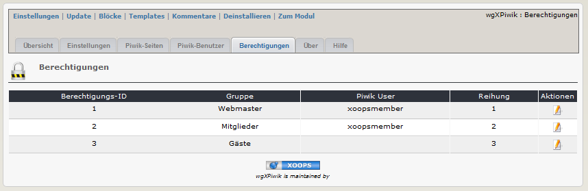

# 2.4 Berechtigungen
Um Piwik in einem iframe auf der Benutzerseite verwenden zu können, müssen sie in Piwik einen Standarduser anlegen, da es aus Sicherheitsgründen nicht zulässing ist, sich im iframe als Super-Acces-User (=Administrator) einzuloggen.
Für weitere Informationen siehe auch [4. Bedienungsanleitung](4operations.md)

#### 2.4.1 Berechtigungen auflisten
Auf den Registerblatt 'Berechtigungen' sehen sie eine Liste der aktuellen Xoops-Gruppen. Sobald sie dieses Registerblatt aufrufen, erfolgt ein Abgleich mit den bestehenden Gruppen (neue Gruppen werden hinzugefügt, mittlerweile gelöschte Gruppen werden wieder entfernt).

#### 2.4.2 Hinzufügen/Bearbeiten von Berechtigungen

#### Piwik User
Wählen sie einen Piwik-Benutzer, dem das Recht 'Ansicht' zugeordnet wurde (für weitere Informationen siehe auch [4. Bedienungsanleitung](4operations.md))
 >**Achtung**: Aus Sicherheitsgründen ist es nicht erlaubt, einen Super-Access-Benutzer für den Login über iframe zu verwenden

#### Reihung
Legen sie die Reihung der Berechtigungen für Benutzer fest, die Mitglied in verschiedenen Gruppen sind.

####2.4.3 Endgültige Einstellungen Berechtigungen (Beispiel)

