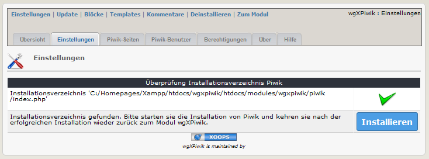
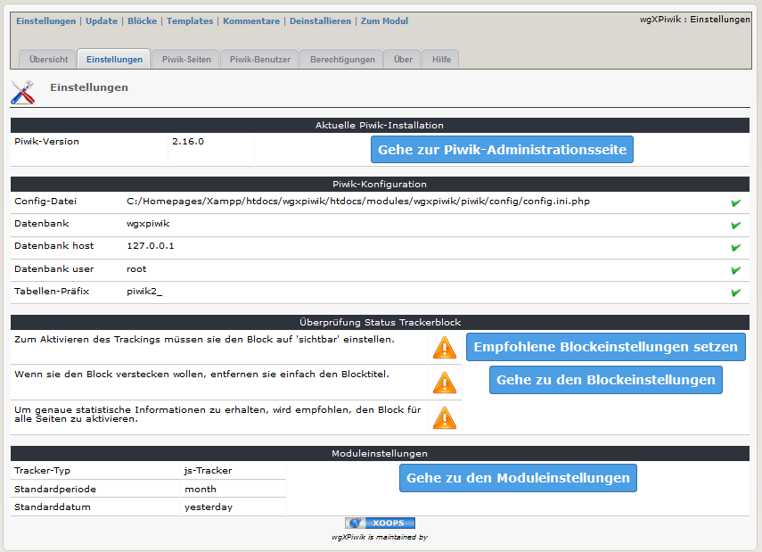
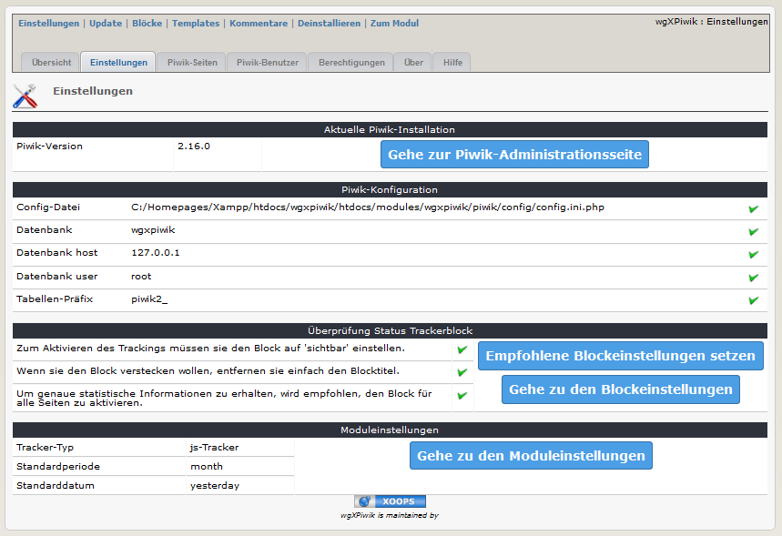

# 2.1 Einstellungen
2.1.1 Nach der Installation von wgXPiwik und vor der Installation von Piwik zeigt das Registerblatt "Einstellungen" 
a) das Ergebnis der Überprüfung des Installationsverzeichnisses von Piwik
b) eine Schaltfläche zum Starten der Piwik-Installation

2.1.2 Nach der Installation von Piwik (siehe auch 
[4. Bedienungsanleitung](4operations.md)) erhalten sie grundlegende Informationen über die wgXPiwik-Einstellungen

Für eine ordnungsgemäße Verwendung von wgXPiwik sollten die empfohlenen Blockeinstellungen verwendet werden (aktiviert, versteckt und auf allen Seiten aktiv)

2.1.3 Endgültige empfohlene Einstellungen

