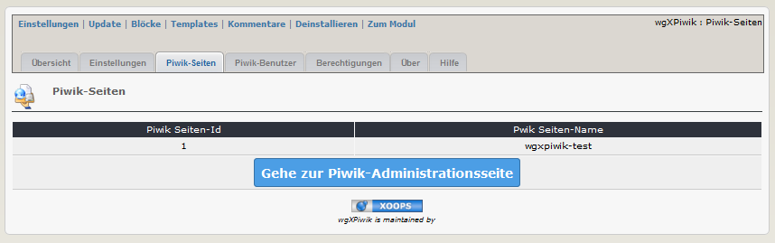

# 2.2 Piwik Sites
Auf dem Registerblatt 'Piwik-Seiten' erhalten sie eine Auflistung der in ihrem aktuellen Piwik registrierten Seiten.

#### 2.2.1 Auflistung nach Modulinstallation/vor der Installation von Piwik

#### 2.2.2 Auflistung nach der Installation von Piwik (Beispiel)
