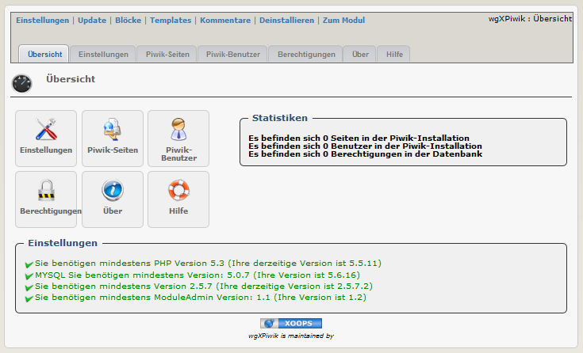

# 2. Administrationbereich

Im oberen Bereich befinden sich 7 Menüpunkte.

|Menüpunkt|	Funktion|
|---|---|
|Einstellungen| Hier können sie die Moduleinstellungen vornehmen |
|Update| Klicken sie hier, wenn sie einige Änderungen am Modul vorgenommen haben, Dateien hochgeladen haben usw. - dadurch wird das Modul neu kompiliert und alle Datenbankeinträge werden erneuert |
|Blöcke| Wenn sie hier klicken, werden sie zur Blockverwaltung weitergeleitet, und es werden die Blöcke des aktuelle Modules vorgefiltert |
|Templates| Hier können sie die Standardtemplates des aktuellen Moduls bearbeiten, verwendet wird dabei der XOOPS Template Manager |
|Kommentare| Dieses Modul unterstützt keine Kommentare, sodass sie zum Xoops Kommentar-Manager weitergeleitet werden |
|Deinstallieren| Sie werden zur Deinstallation des Moduls weitergeleitet |
|Zum Modul| Wenn das Modul auf der Benutzerseite sichtbar ist, werden sie dorthin weitergeleitet |

## Dashboard
Auf der Hauptübersicht erhalten Sie Informationen über die Funktionen und den Inhalt des Moduls.

### Funktionalitäten für Administratoren:
* [Einstellungen](2admin_settings.md)
* [Piwik-Seiten](2admin_sites.md)
* [Piwik-Benutzer](2admin_users.md)
* [Berechtigungen](2admin_permissions.md)
* [Über](2admin_about.md)
* [Hilfe](2admin_help.md)