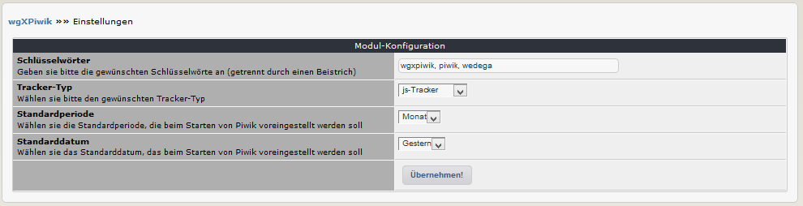

# 3. Einstellungen

In den Moduleinstellungen können Sie verschiedene Optionen festlegen: 

## 3.1 Optionen im Detail
#### Schlüsselwörter
Bitte hier die gewünschten Schlüsselwörter eingeben (getrennt durch einen Beistrich), welche dann in den Metatags verwendet werden.

#### Tracker-Typ
Bitte wählen sie den gewünschten Tracker-Typ:
* js-Tracker
* Tracker image

#### Standardperiode
Wählen sie die Standardperiode, die beim Starten von Piwik voreingestellt werden soll

#### Standarddatum
Wählen sie das Standarddatum, das beim Starten von Piwik voreingestellt werden soll