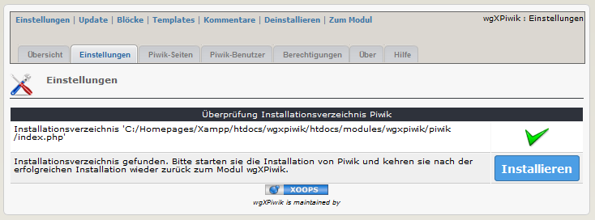
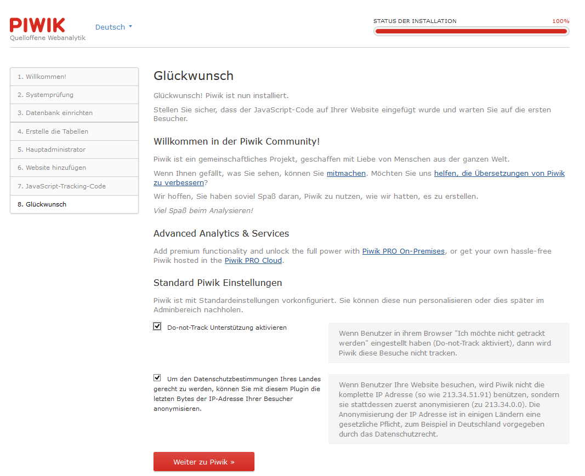

# 4.0 Bedienungshinweise

Um dieses Modul verwenden zu können, müssen sie folgenden ausführen:
1. Installieren sie das Modul
2. Gehen sie zum Modul wgXPiwik > Einstellungen

3. Klicken sie4 auf "Installieren" und installieren sie Piwik

Führen sie den gesamten Installationsprozess von Piwik aus

4. Nach der erfolgreichen Installation von Piwik müssen sie noch die erforderlichen Einstellung in Piwik vornehmen. Um Piwik in einem iframe auf der Benutzerseite verwenden zu können, müssen sie in Piwik einen Standarduser anlegen, da es aus Sicherheitsgründen nicht zulässing ist, sich im iframe mit Super-Acces-Rechten (=Administrator) einzuloggen.
Für weitere Informationen siehe auch [4. Bedienungsanleitung](4operations.md)
5. Melden sie sich mit dem gerade erstellen Admin-Konto bei Piwik an.

Gehen sie zur Administration 

a) Gehen sie zu Benutzer
b) Erstellen sie einen neuen Benutzer (in meinem Beispiel heißt dieser "xoopsmember")
c) Ändern/Aktivieren sie das Recht auf "Ansicht"

5. Gehen sie zurück zum Administartionsbereich des Moduls wgXPiwik
6. Nehmen sie die erforderlichen Modul- und Blockeinstellungen vor (siehe auch [2.2 Einstellungen](2admin_settings.md)) und vergeben sie die Rechte für die Xoops-Gruppen (siehe auch [2.4 Berechtigungen](2admin_permissions.md))
7. Passen sie Piwik auf der Benutzerseite entsprechen ihren Wünschen an (siehe auch [5. Benutzerseite](5userside.md))
8. Für detaillierte Informationen über Piwik und die Widgets von Piwik besuchen sie bitte http://piwik.org/

