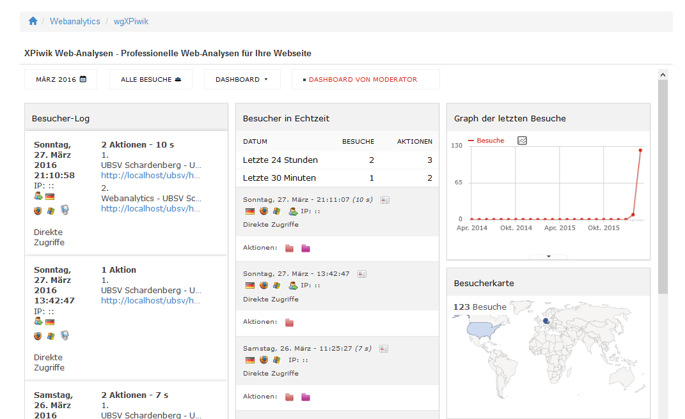

# 5. Die Userseite

Von den Usern sind grundsätzlich keine Aktionen erforderlich, aber sie können Piwik entsprechend ihren Wünschen anpassen.
Klicken Sie auf "Dashboard" und aktivieren bzw. deaktivieren die gewünschten Piwik Widgets. 

Für detailierte Informationen über Piwik und die Widgets in Piwik besuchen sie bitte http://piwik.org/