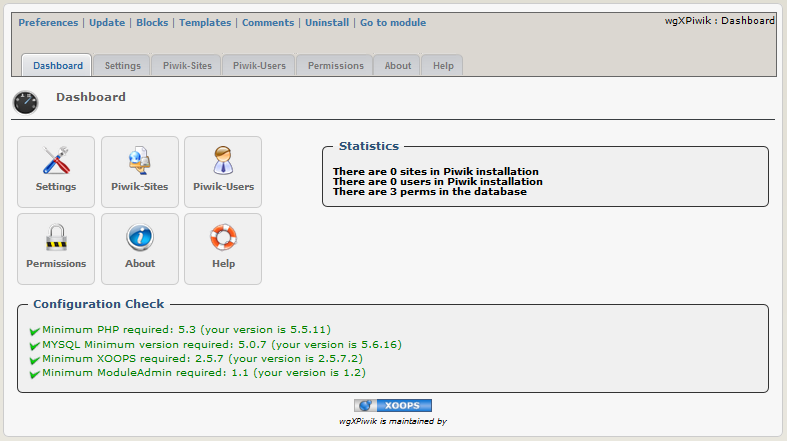

### _XOOPS Documentation Series_

# Module wgXPiwik
#### Version: 1.06 RC1
#### for XOOPS 2.5.7+
#### for PHP 5.5, 5.6 and 7.0
      

            
## User Manual

© 2014 The XOOPS Project (www.xoops.org)    

## Module Purpose 

This module is for implementation of Piwik to your Xoops.

* Piwik is included in the module
* Installing Piwik can be started from module, but you can't admin Piwik himself (create user, admin user rights,...) via this module. You have to use Piwik admin ui.
* You can provide Piwik Charts/Widgets via iframe on user site. As Piwik function 'logme' is used, therefore no separate login for your users is necessary.
* The permissions for Xoops User you can set per group in the module
* Tracking will be done via a block. Therefore you can activate tracking only for specific modules, all modules or only the startpage.

For detailed information about Piwik and widgets of Piwik goto http://piwik.org/

 
*Figure 1: Main view of the wgXPiwik Module (Admin side)*

# Table of Content

* [Install/Uninstall](book/1install.md)
* [Administration Menu](book/2administration.md)
* [Preferences](book/3preferences.md)
* [Operating Instructions](book/4operations.md)
* [The User Side](book/5userside.md)
* [Blocks](book/6blocks.md)
* [Templates](book/7templates.md)
* [Module Credits](book/9credits.md)

##License:

 Unless specified, this content is licensed under a <a rel="license" href="http://creativecommons.org/licenses/by-nc-sa/4.0/">Creative Commons Attribution-NonCommercial-ShareAlike 4.0 International License</a>.

All derivative works are to be attributed to XOOPS Project (www.xoops.org)

##Tutorial Version: 1.1