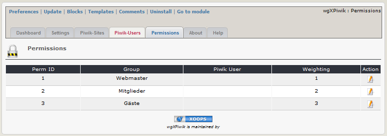

# 2.4 Permissions
In order to use Piwik in iframe on user side you have to create a standard user in Piwik, because of security reason it is not allowed to login via iframe with a super access user (=admin). For more information see [4. Operations](4operations.md)

#### 2.4.1 List permissions
On the dashboard tab 'permissions' you see a list of the existing xoops groups with the permissions. If you goto this tab, the groups will be automatically merged with the Xoops groups (new groups will be added, meanwhile removed groups will be deleted).

#### 2.4.2 Add/edit permissions

#### Piwik User
Select one of the Piwik Users, which have the right "view" (for more information see also [4. Operations](4operations.md))
 >**Attention**: for security reason it is not allowed to select a super access user for log in via iframe

#### Weight
You can define the ranking of the permissions for users, which are members of different groups.

#### 2.4.3 Final permissions settings (example)

