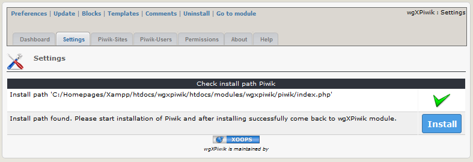
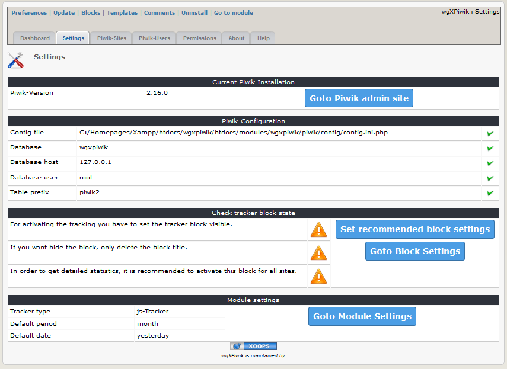
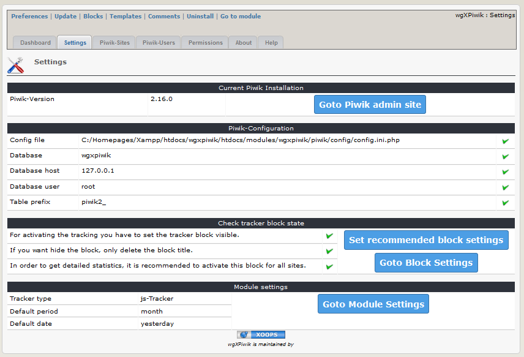

# 2.1 Settings
2.1.1 After installing wgXPiwik and before installing Piwik the tab "Settings" 
a) show the result of the check about the piwik install path
b) offers a button for starting Piwik installation

2.1.2 After installing Piwik (see also 
[4. Operations](4operations.md)) you get basic information about wgXPiwik settings

For proper usage of the module you should use the recommended block settings (activated, hidden and used for all sites)

2.1.3 Final recommended settings

