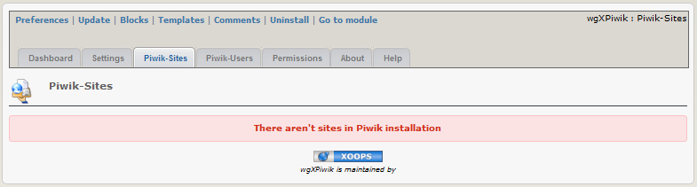
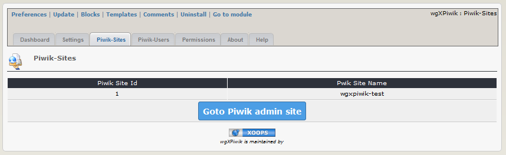

# 2.2 Piwik Sites
On the dashboard tab 'Piwik-Sites' you get a list of the sites registered in your current Piwik.

#### 2.2.1 List after installing module/before installing Piwik

#### 2.2.2 List after installing Piwik (example)
