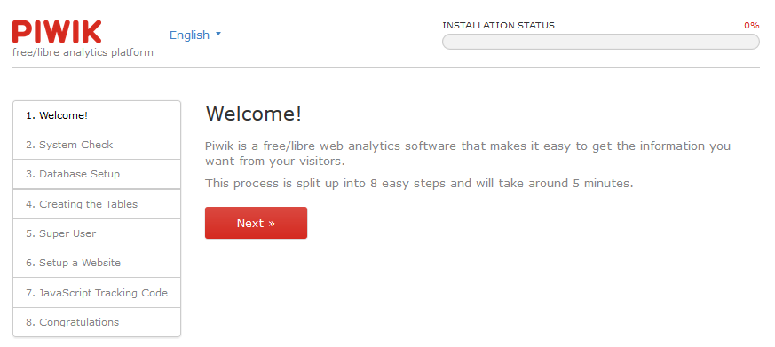
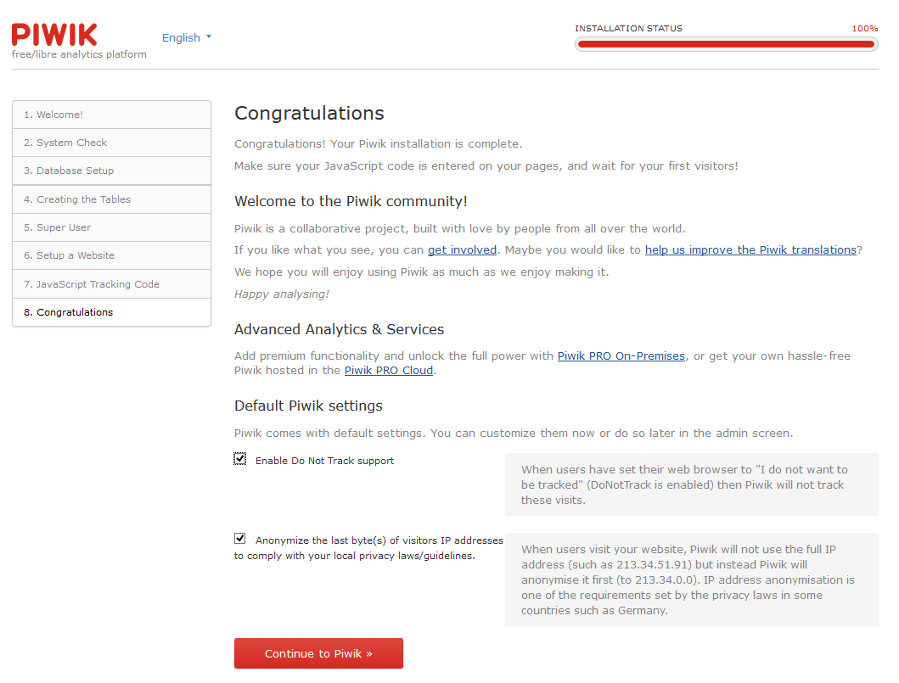
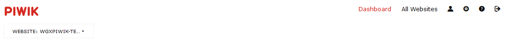
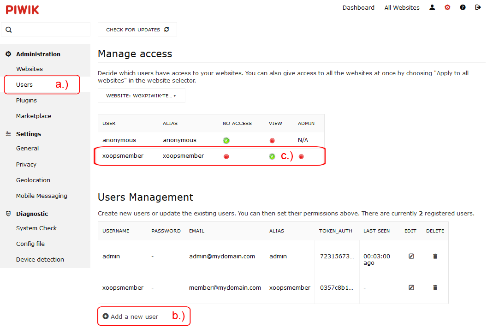

# 4.0 Operating Instructions

To use this module you have to to following:
1. Install the module himself
2. Goto module wgXPiwik > settings

3. Click on "Install" and install Piwik

Run through install process of Piwik

4. After installing of Piwik successfully you have to setup Piwik. To used Piwik in an iframe on user side, you need to create a non admin user, because of security reasons it is not allowed to use Piwik in an iframe with super access rights (=admin)
5. Login to Piwik with admin account (which you have defined minutes ago). 

Goto administration 

a) goto Users
b) add a new user (in my example I named him "xoopsmember"
c) set right "view" to enabled

5. Go back to module admin area of wgXPiwik
6. Do the necessary module and block settings (see also [2.2 Settings](2admin_settings.md)) and create the the permissions for the xoops usergroups (see also [2.4 Permissions](2admin_permissions.md))
7. Adopt your Piwik on user side (add/remove wigdets) as you want (see also [5. User side](5userside.md))
8. For detailed information about Piwik and widgets of Piwik goto http://piwik.org/
