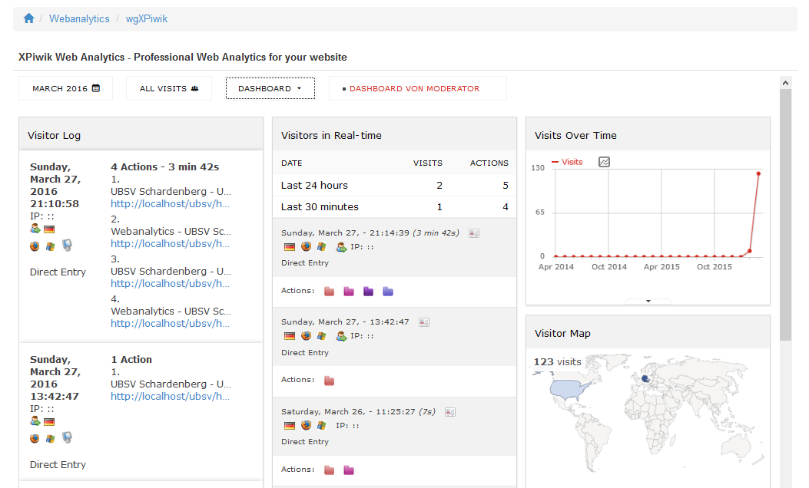

# 5. The User Side

For the users there is no action required, but they can adopt Piwik as they want.
Click on "Dashboard" and enable or disable Piwik widgets. 

For detailed information about Piwik and widgets of Piwik goto http://piwik.org/